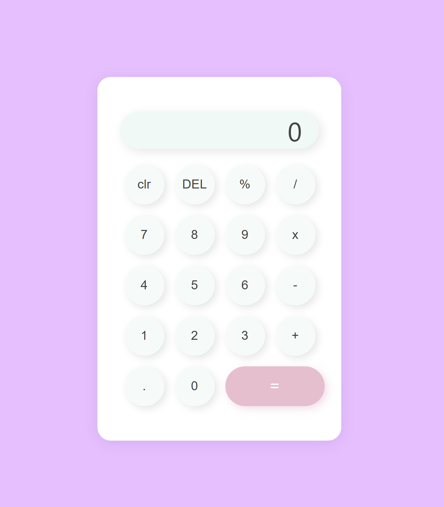

🧮 Neumorphic Calculator
A modern and stylish calculator built using HTML, CSS, and JavaScript, designed with a clean and minimal Neumorphism (Soft UI) design aesthetic.

🔍 Preview

Soft shadows and smooth surfaces for a beautiful tactile interface.

✨ Features
Basic arithmetic operations: Addition, Subtraction, Multiplication, Division

Clean and responsive UI using Neumorphism design

Interactive button effects and smooth user experience

Mobile-friendly layout

Keyboard input support (optional, if implemented)

💡 Technologies Used
HTML5 – Semantic structure of the calculator

CSS3 – Styling with focus on Neumorphism using box-shadows and gradients

JavaScript – Logic and interactivity

🛠️ Installation / How to Use
Clone the Repository

bash
Copy
Edit
git clone https://github.com/abelNex01/neumorphic-calculator.git
Open in Browser

Open the index.html file in any modern browser:

sql
Copy
Edit
Right click → Open with → Browser
📁 Project Structure
plaintext
Copy
Edit
neumorphic-calculator/
│
├── index.html # Main calculator layout
├── style.css # Neumorphic styles
├── script.js # Calculator logic
└── README.md # Project documentation
📸 Screenshots

_Screenshot of the Neumorphic Calculator interface_

If hosted online, you can also include a live demo link:

🔗 Live Demo

🧠 Inspiration
This project was inspired by the growing trend of Neumorphism, aiming to bring a realistic, soft UI experience to web interfaces.

🚀 Future Improvements
Add theme switcher (light/dark mode)

Add keyboard support for faster input

Add history of calculations

Support for advanced math functions (square root, percentages, etc.)

📄 License
This project is open-source and available under the MIT License.
